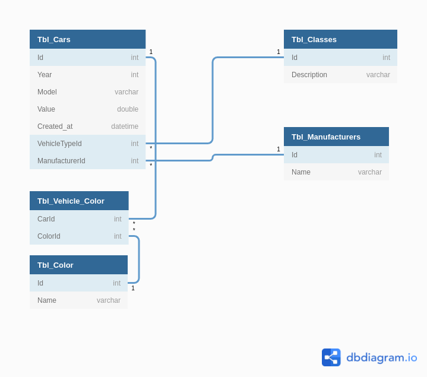

# RoadLovers

Projeto criado em **ASP .NET MVC** para a matéria de **Enterprise Application Development**.

## Conteúdo

- [Ideia](#ideia)
  - [Sprint 1](#sprint-1)
  - [Sprint 2 e 3](#sprint-2-e-3)
- [Modelo](#modelo)
- [Integrantes](#integrantes)

## Ideia

### Sprint 1

A ideia é criar um CRUD para cadastro de carros, contendo dados como:

- id (INTEGER)
- Ano (INTEGER)
- Modelo (STRING)
- Valor (DOUBLE)
- Data de cadastro (DATETIME)
- Montadora (ENUM)
- Categoria (ENUM) [SUV, UTILITÁRIO, ETC]

Para realizar o filtro, o usuário poderá escolher por:

- [x] **Ano:** Ano do veículo

### Sprint 2 e 3

Sendo atualizada mais tarde para cadastro de veículos em geral implementando:

- **Remodelagem:** A classe de carros foi remodelada para comportar a persistência de dados assim como outras classes foram criadas.
- **Filtros:** Além do existente foi incluso também:
  - [x] **Classe:** Muscle, Tuner, Luxo...
  - [x] **Fabricante:** Mitsubishi, Chevrolet, Nissan...

## Modelo

## Integrantes

|  RM   | Nome           |
| :---: | -------------- |
| 84198 | Daiane Estenio |
| 85398 | Luís Paulino   |
